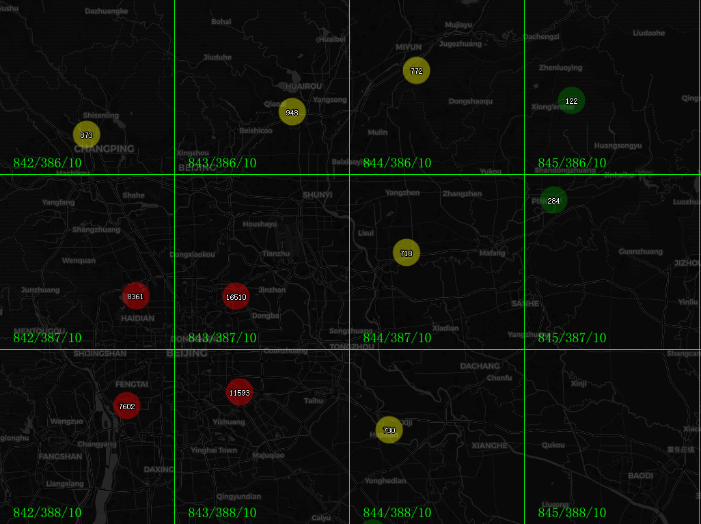

# maptalks.tileclusterlayer

**markers cluster by tile**



## how to use?

* by cdn

```html
<link rel="stylesheet" href="https://www.unpkg.com/maptalks/dist/maptalks.css" />
<script type="text/javascript" src="https://www.unpkg.com/maptalks/dist/maptalks.min.js"></script>
<script type="text/javascript" src="https://www.unpkg.com/maptalks.tileclusterlayer@latest/dist/maptalks.tileclusterlayer.min.js"></script>
```

* by npm

```sh
  npm i maptalks
# npm i maptalks-gl
  npm i maptalks.tileclusterlayer

```

* [demo online](https://deyihu.github.io/maptalks.tileclusterlayer/test/index.html)
* [tileSize 512](https://deyihu.github.io/maptalks.tileclusterlayer/test/beijing-tilesize-512.html)
* [set infowindow](https://deyihu.github.io/maptalks.tileclusterlayer/test/setinfowindow.html)
* [million markers cluster](https://deyihu.github.io/maptalks.tileclusterlayer/test/perf.html)

```js
function getClusterMarkerSymbol(count, features) {
    const symbol = {
        markerType: "ellipse",
        markerWidth: 65,
        markerHeight: 65,
        markerFill: "#fff",
        markerLineWidth: 0,
        markerFillOpacity: 1,
        markerOpacity: 1,
        textSize: 15,
        textName: count,
        textHaloFill: "#000",
        textHaloRadius: 1.2,
        textFill: "#fff",
    };
    if (count > 5000) {
        symbol.markerFill = "red";
    } else if (count > 1000) {
        symbol.markerFill = "yellow";
    }
    return symbol;
}

const tileClusterLayer = new maptalks.TileClusterLayer("tileClusterLayer", {
    tileSize: 256, // 256/512
    maxClusterZoom: 18,
    minClusterCount: 5,
    //when cluster marker click will show children markers
    clusterDispersion: true,
    // show cluster marker children max count
    dispersionCount: 500,
    //get cluster marker symbol
    clusterMarkerSymbol: getClusterMarkerSymbol,
    // cluster marker,marker events
    markerEvents: {
        click: function(e) {
            console.log(e);
            if (e.target.getProperties().isCluster) {
                console.log('is cluster marker');
            }
        },
    },
});
tileClusterLayer.addTo(map);

tileClusterLayer.on('clusterstart clusterend', e => {
    console.log(e);
});

const geojson = {
    type: 'FeatureCollection',
    features: [
        ...
    ]
};
tileClusterLayer.setData(geojson);

//use in ESM

import * as maptalks from 'maptalks';
import {
    TileClusterLayer
} from 'maptalks.tileclusterlayer';
const tileClusterLayer = new TileClusterLayer("tileClusterLayer", {
    ...
});
```
